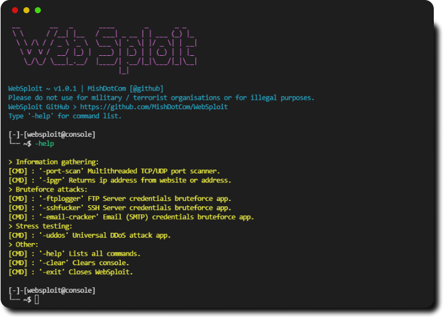

# WebSploit 
[](https://github.com/MishDotCom/WebSploit/releases/tag/v1.3)
[](https://img.shields.io/badge/license-GPLv3-blue)
[](https://img.shields.io/badge/language-c#-red)

<h2>Description</h2>

**WebSploit** is a web stress testing and pentesting tool, offering a useful set of tools to perform **web level** attacks.

<p align="center">

</p>

Disclaimer: **I am under no circumstances responsible of any wrong way this app is used. Meant only for educational purposes and white hat hacking.**

<h2>Commands and Tools 🧰</h2>

Websploit offers a shell like interface with the following commands:

```text
  > Information gathering:
'-prts'  Scans a given target for open ports.
'-ipgr'       Tool similar to nmap.
  > Password attacks:
'-ftpl'  Ftp server credentials bruteforcer.
'-sshf'  Ssh credentials bruteforce app.
'-ecrk' Email (SMTP) login credentials bruteforce app.
  > Stress testing:
'-uddos'      Complete DDoS and stress testing tool for all web protocols (HTTP/HTTPS/TCP/UDP)
  > Other:
'help'       Provides the command list.
'cls'      Refreshes the shell screen.
'exit'       Closes WebSploit.
```
Each tool has it's own command syntax. In WebSploit type '<TOOL'S NAME> -help' for the tool's command list.

## Installation ⚙️

<h2>For windows:</h2>
1. Download the folder called <code>websploit win-x86.zip</code>.<br>
2. Extract the folder and place it in a directory of your choice.<br>
3. Run the file called <code>WebSploit.exe</code> in CMD or PowerShell as Administartor.<br>

Disclaimer: **Do NOT remove any of the .dll files or the app will cease to work.**<br>

<h2>For linux-debian:</h2>
1. Download the folder called <code>WebSploit deb-x64.zip</code><br>
2. Extract the folder.<br>
3. Open a terminal and CD into the folder.<br>
4. Run <code>chmod 777 ./WebSploit</code><br>
5. Run the app using <code>sudo ./WebSploit</code><br>

## Credits 💡

**Gloria <33**

